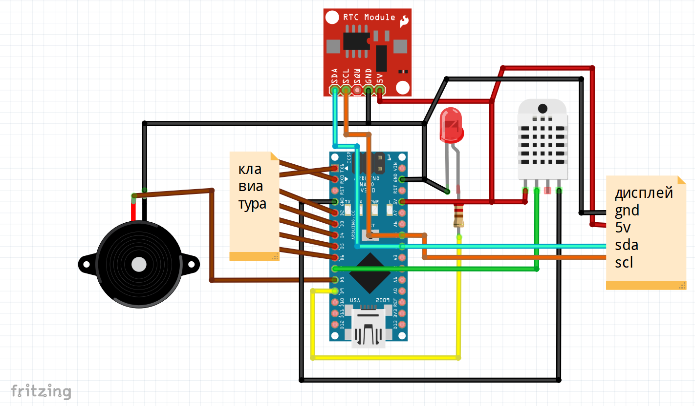
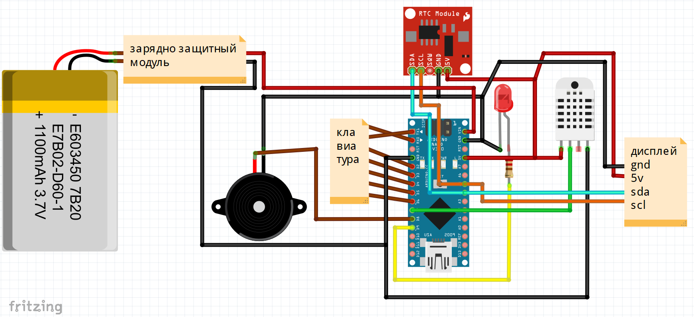

# Часы с будильником  
Электронный будильник с дисплеем, клавиатурой, датчиком температуры, и пищалкой.  
Функционал:  
* Отображение даты;
* Отображение времени;  
* Отображение температуры;  
* Будильник с пищалкой, паролем и светодиодом;
* Система начальной настройки, можно настроить отображение даты, время работы подсветки, настройку можно повторить из пункта настроек;
* Все настройки в том числе и настройки будильника сохраняются в энергонезависимую память и не сбрасываются;
* Выключение будильника по нажатию на рандомные кнопки; 
# Схема питания от USB

# Схема питания от Аккумулятора

***
# Настройки в коде
        int Backlight_pin = 10; //Пин подсветки
        int led_pin = 9;  //Пин светодиода
        int dht_pin = 7; //Пин датчика температуры
        int busser_pin = 8; //Пин пищалки
        AmperkaKB KB(6, 5, 4, 3, 2, 1, 0); //Пины матричной клавиатуры
        LiquidCrystal_I2C lcd(0x3F,16,2); //Адрес и размер дисплея
        DHT dht(dht_pin,DHT11); //Тип дачтика: DHT11 или DHT22
        C:\Program Files (x86)\Arduino\libraries\
# Установка
* **Библиотеки** - библиотеки для дисплея и прочего скопировать в  
       `C:\Program Files (x86)\Arduino\libraries\` (Windows x64)  
       `C:\Program Files\Arduino\libraries\` (Windows x86)
***
*For English: Библиотеки translating libraries. 
